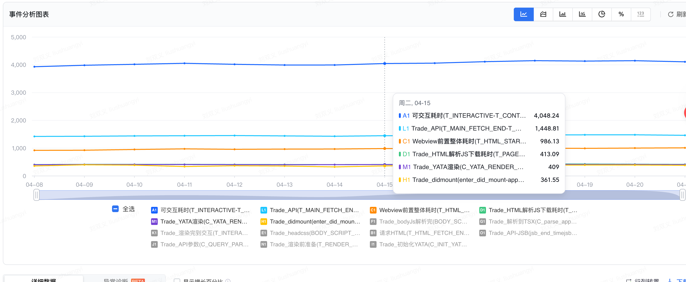
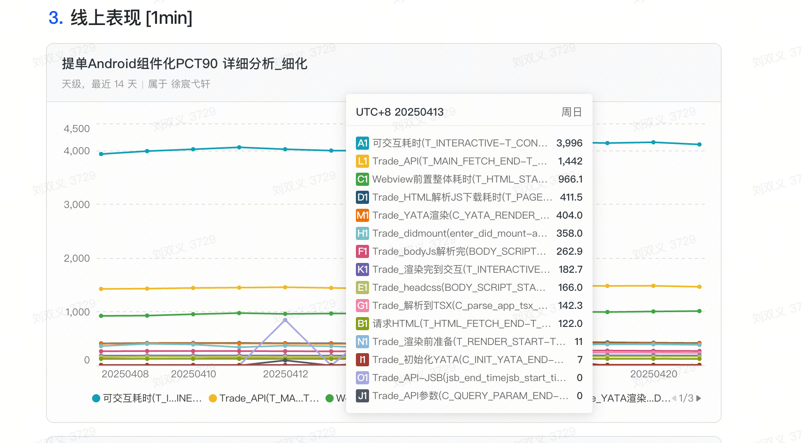
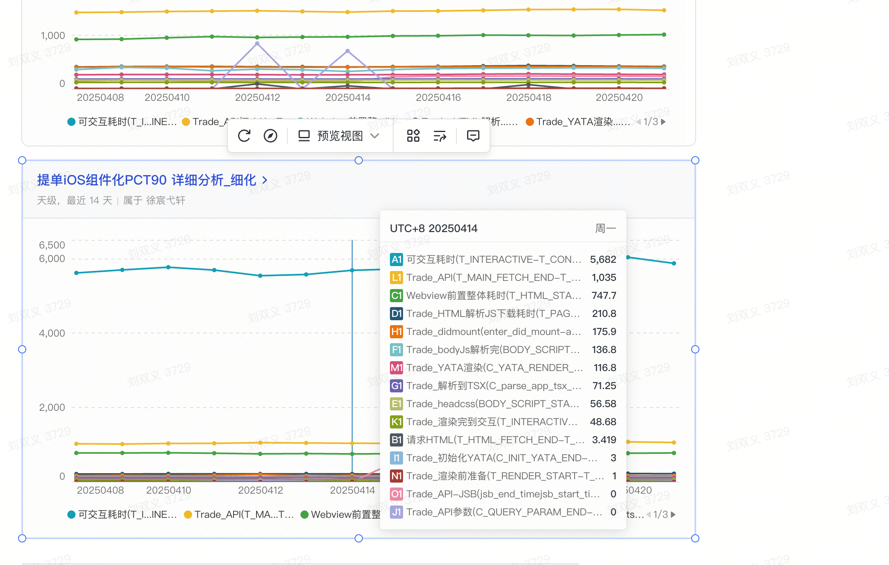
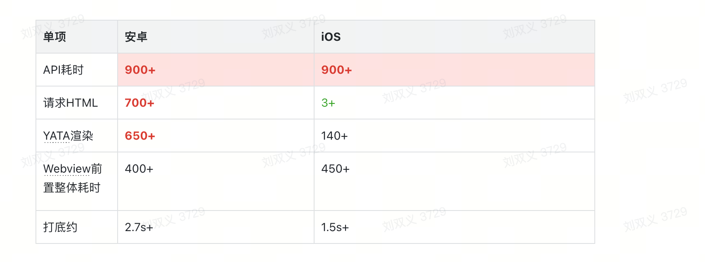
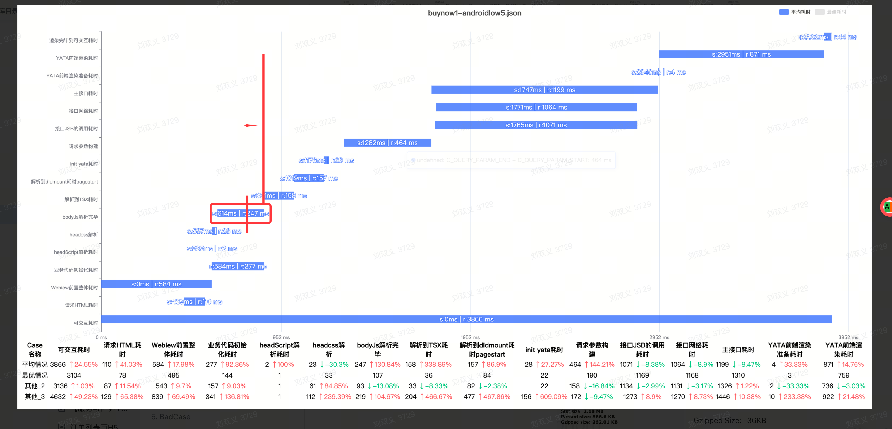
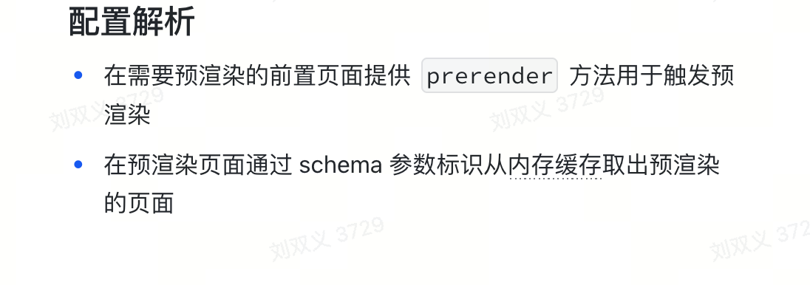

## 滴滴一面

### 项目相关
1. 为什么安卓比ios慢那么多tti： 
    1. 因为本身安卓的设备有很多低端机，拉低了整体的性能
    2. 本身安卓语言架构影响性能也会有所影响
2. lynx渲染原理：


### 八股文
1. type 和 interface 的区别
  - 声明合并： 
    - interface 多次定义同名接口会进行合并
    - type 不可重复定义同名类型，否则会报错
  - 扩展方式
    - interface 通过 extends 扩展接口
    - type 通过 & 组合多种类型
  - 灵活性
    - interface 仅可定义对象类型（函数、对象、类结构）
    - type 可定义任意类型：包括联合类型、原始类型 元组
  - 高级操作
    - type 可以支持映射类型、条件类型、typeof动态引用等高级操作
    ``` ts
      type Conditional<T> = T extends string ? 'string' : 'other';
      type MappedType = { [K in 'a' | 'b']: number };
      type User = typeof someExistingObject;     // 引用其他变量类型
    ```
  - 实现和继承
   - 类实现： 两者都可以通过 implement 来实现，但interface更符合语义
   - 泛型约束： 
   ``` ts
      interface Lengthwise { length: number; }
      function logLength<T extends Lengthwise>(arg: T) { ... }
    ```
2. 说说React diff原理
- 同级比较，不跨层级比较
- 比较同级节点类型，类型不同直接删除子树构建新树
- 通过key来标识同层级可复用的节点
- 相同类型的DOM元素：React 会 保留 DOM 节点，仅更新变化的属性。
- 相同的组件类型：如果组件类型相同，复用组件实例，触发更新生命周期，递归diff子节点
3. useCallback 和 useMemo 的区别
- useCallback可以认为是useMemo的语法糖
- usecallback： 缓存函数
- useMemo: 缓存一个高开销的计算结果


### coding
1. 实现函数
``` js
function f(b) {
  console.log(this.a, b);
} 
// Funtion.prototype.fakeBind
f.fakeBind = (a, inputB) => {
  if (inputB) {
    return () => f.bind({
      a: a.a
    })(inputB);
  }
  
  return (b) => f.bind({
    a: a.a
  })(b)
}

f.fakeBind({ a: 3 })(4); //=> 3, 4 
f.fakeBind({ a: 3 }, 10)(11); //=> 3, 10
```

2. 写一个 mySetInterVal(fn, a, b),每次间隔 a,a+b,a+2b,...,a+nb 的时间，然后写一个 myClear，停止上面的 mySetInterVal

``` js
function mySetInterval(fn, a, b) {
  const containerId = {
    timerId: null,
    count: 0,
    isClear: false;
  }

  function execFn = () => {
    const {
      timerId,
      isClear,
      time
    } = containerId
    if (isClear) return;
    fn();
    cotainerId.count = cotainerId.count + 1;
    const nextTime = a + cotainerId.count * b;
    containerId.timerId = setTimeout(execFn, cotainerId.time);
  }
  containerId.timerId = setTimeout(execFn, a)
  return containerId;
}

function myClear(container) {
  if (container.timerId) {
    clearTimeout(container.timerId);
    container.isClear = true
  }
}
```

3. console.log 输出题

``` js
async function async1 () {
  console.log('b');
  await async2();
  console.log('e')
}

function async2() {
  console.log('c')
}

console.log('a');
async1();

setTimeout(() => {
  console.log('g')
},0);

new Promise((res,rej) => {
  console.log('d')
  res();
}).then(() => {
  console.log('f')
})
```
## 滴滴二面 20250422

#### 项目 - 性能优化的具体数据，各个阶段的耗时，反思，是不是还有更进一步的优化空间
- 性能优化做了哪些改进点？怎么做的
- 各个阶段的详细耗时， 白屏的时间大概是多少
  1. 白屏时间： webview + 容器初始化耗时： ios ： 200ms 安卓：450ms+
  2. 
  
  
  
  安卓和ios主要的差异点在 html解析+页面渲染真正绘制
- 怎么定位那个阶段的耗时多少

1. 请求html耗时
2. webview前置耗时
3. 业务代码初始化耗时
4. headScript解析耗时
5. headcss解析
6. body js解析完毕
7. 解析到tsx耗时
8. 解析到didmount耗时，pageStart
9. init yata耗时
10. 请求参数构建
11. jsb调用耗时
12. 接口网络耗时
13. 主接口耗时
14. 前端渲染准备耗时
15. 渲染耗时
16. 可交互
请求参数构建耗时400多ms，大数据注入
- 预渲染能力有缓存吗？
预渲染本身就是一种缓存
- 缓存销毁策略
  - 如果页面需要快速上线，或需要让用户已缓存的页面缓存失效，可以通过 query 拼接参数配合 settings 版本进行缓存清理，这样在离线化包更新或 settings 更新时都会让缓存失效。
  - 内存告警需要销毁所有缓存
- 如果给你一个页面做性能优化，你会怎么做，有没有思考和沉淀？
  1. 通过性能分析工具/线上埋点数据分析各个阶段耗时，为什么需要这么长时间
  2. 根据不同阶段不同耗时分析，采取可优化的点
  3. 本地验证
  4. 实验验证


#### 开放性问题
1. 团队内存在的问题
- 详情页的代码很乱需要治理，包括写法不规范、一些实验字段没有进行治理
- 业务开发规范问题，产出SOP，严格执行每一步，规避CR后改动问题
- 业务层面上来说：业务增长乏力，亟需一个突破点，