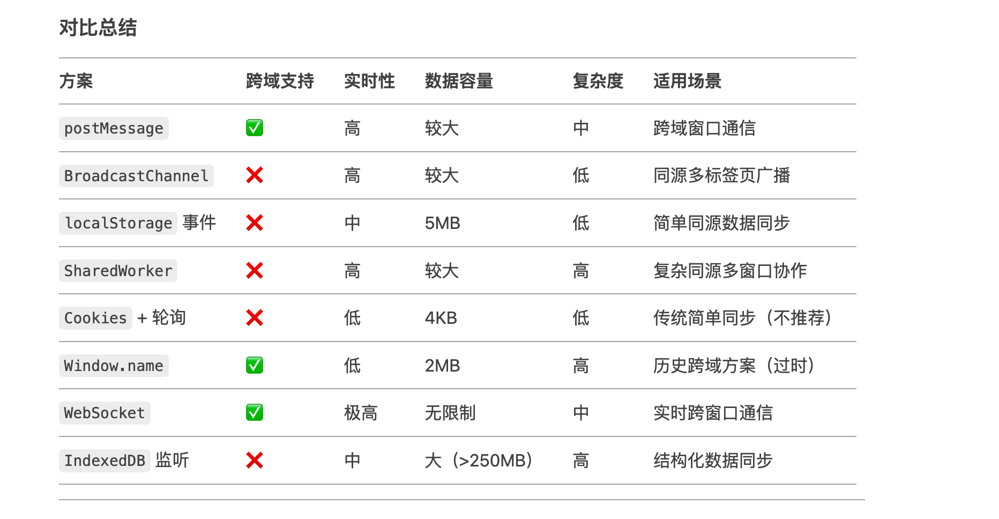

## Construct

### http缓存以及相关的code码，以及怎么强制清楚缓存等
- 1XX
- 2开头
- 3开头
- 4开头
  - 400 Bad Request：请求无效，服务器无法理解请求。
  - 401 Unauthorized：请求未授权，需提供认证信息。
  - 403 Forbidden：服务器拒绝请求，客户端没有权限访问资源。
  - 404 Not Found：请求的资源未找到。
  - 405 Method Not Allowed：请求的方法不被允许。 
- 5开头
  500 Internal Server Error：服务器内部错误，无法完成请求。
501 Not Implemented：服务器不支持请求的方法。
502 Bad Gateway：作为网关或代理的服务器收到无效响应。
503 Service Unavailable：服务器当前无法处理请求，可能是由于过载或维护。
504 Gateway Timeout：作为网关或代理的服务器未能及时从上游服务器获取请求。

### 浏览器的渲染机制
1. 渲染流程
2. 回流和重绘的优化策略

### css样式选择的优先级
 - 内联样式 > ID选择器 > 类/属性/伪类选择器(:, eg: :hover) > 元素/伪元素选择器（::, eg: ::before）
 - 空格： #spec .active 匹配#spec元素的后代元素
 - ，： #spec, .active 匹配这两个选择器
 ``` html

 <!-- index.html -->
<div>
   <div id=”spec” class=”spec active”>some text</div>
</div>
 ```

``` css index.css 考察specificity
	div { color: red; } (0,0,1)
	div * { color: green; } (0,0,1)
  div *:first-child { color: #f2f; } (0,1,1)
  div *:first-of-type { color: #fff; } (0,1,1)
  #spec { background-color: blue; } (1,0,0)
  .spec { background-color: grey; } (0,1,0)
  .active { background-color: #eee; } (0,1,0)
  .spec .active { background-color: #fff; } (0,2,0)
  #spec .active { background-color: #232; } (1,1,0)
  .spec .active { background-color:  #aaa; } (0,2,0)

    /* div { color: red; }
	div * { color: green; }
  div *:first-child { color: #f2f; }
  div *:first-of-type { color: grey; }
  #spec { background-color: blue; }
  .spec { background-color: grey; }
  .active { background-color: #eee; }
  .spec .active { background-color: #fff; }
  #spec .active { background-color: red; }  // 匹配#spec元素的后代元素
  .spec .active { background-color:  #aaa; } */
```

问：id 为 spec 的元素对应的 color 和 background-color 分别是？


#### js 相关
1. 原始值与引用类型的区别
2. localStorage和sessionStorage的区别
localStorage 和 sessionStorage 是浏览器提供的 Web Storage API，用于在客户端存储键值对数据。它们的核心区别体现在 生命周期、作用域 和 数据共享范围 上，以下是详细对比：
  localStorage： 
    1. 数据永久存储，除非手动删除或清除缓存， 保存用户的主题偏好、语言设置等长期数据。
    2. 同一域名下的所有标签页和窗口共享数据，多标签页操作同一数据会互相影响

  sessionStorage：数据仅在当前会话有效，存储当前页面的临时表单数据，刷新页面保留，关闭标签后消失
    1. 数据仅在当前会话有效，关闭标签页或浏览器窗口后自动清除
    2. 仅限当前标签页（同一域名下也不共享），每个标签页独立存储，互不干扰
    2. 

    localStoage 所有操作均为同步执行，频繁读写可能阻塞主线程，需避免存储过大或高频操作。
3. 窗口间的通信方式
  1. window.postMessage
  2. 
  

#### react相关
1. 类组件的生命周期
2. setState的更新流程
  - 触发更新与队列化
状态更新入队：
当调用 setState 时，React 会将新的状态对象（partialState）推入组件实例的 _pendingStateQueue 队列中。若存在回调函数（callback），则将其推入 _pendingCallbackQueue18。

合并更新：
在队列中，React 会对多次 setState 调用的状态进行合并。若使用对象形式（如 setState({ count: 1 })），相同属性的更新会被覆盖；若使用函数形式（如 setState(prev => prev + 1)），则按顺序执行并基于前一次结果更新67。

- 批量更新判定
enqueueUpdate 处理：
React 通过 enqueueUpdate 函数判断当前是否处于批量更新模式。若 batchingStrategy.isBatchingUpdates 为 true，则将组件实例标记为“脏组件”（放入 dirtyComponents 队列等待后续处理）；否则立即触发批量更新18。

事务机制：
批量更新由事务（Transaction）机制控制。例如，在 React 生命周期或合成事件中，事务的 initialize 阶段会将 isBatchingUpdates 设为 true，在 close 阶段统一处理队列中的更新并重置标志位47。

-  更新合并与调度
批量合并：
所有队列中的状态更新会被合并为一次更新，避免多次渲染。例如，连续调用 100 次 setState 只会触发一次 render23。

调度机制：
在 React 16+ 的 Fiber 架构中，更新被分为 Render 阶段（生成 Fiber 树）和 Commit 阶段（更新 DOM）。React 根据调度优先级决定何时执行更新，支持可中断渲染以提高性能57。

-  同步与异步场景
异步场景：
在 合成事件（如 onClick）和 生命周期函数（如 componentDidMount）中，setState 表现为异步。此时 React 处于事务控制下，状态更新被延迟到事务结束后统一处理26。

同步场景：
在 原生事件（如 addEventListener）或 异步回调（如 setTimeout）中，setState 可能表现为同步。因为这些场景未启用批量更新，isBatchingUpdates 为 false，更新立即触发67。

-  状态更新与渲染
状态应用：
React 将合并后的新状态应用到组件实例的 state 属性，并通过 shouldComponentUpdate 决定是否触发重新渲染8。

回调执行：
若 setState 传入了回调函数，该回调会在组件重新渲染后执行（componentDidUpdate 之后）36。
