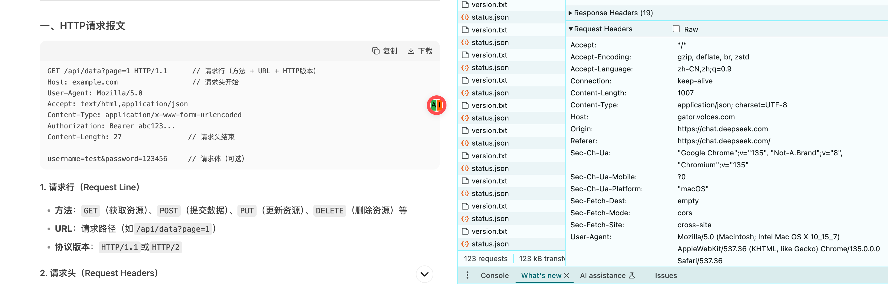
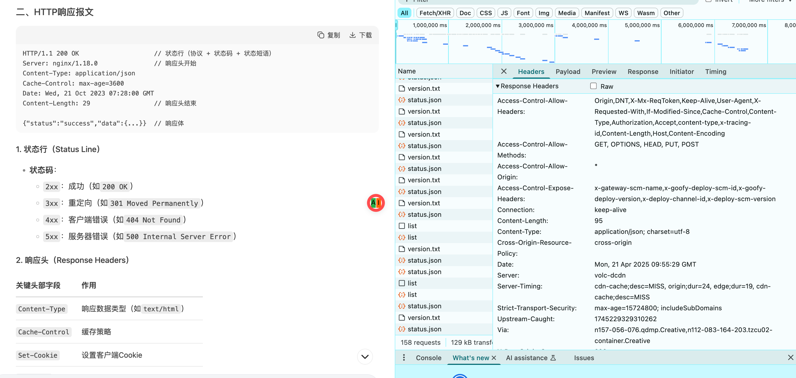

### 拓竹

#### http报文内容

``` html

GET /api/data?page=1 HTTP/1.1      // 请求行（方法 + URL + HTTP版本）
Host: example.com                  // 请求头开始
User-Agent: Mozilla/5.0
Accept: text/html,application/json
Content-Type: application/x-www-form-urlencoded
Authorization: Bearer abc123...
Content-Length: 27                // 请求头结束

username=test&password=123456     // 请求体（可选）

```
响应：

``` html
HTTP/1.1 200 OK                    // 状态行（协议 + 状态码 + 状态短语）
Server: nginx/1.18.0               // 响应头开始
Content-Type: application/json
Cache-Control: max-age=3600
Date: Wed, 21 Oct 2023 07:28:00 GMT
Content-Length: 29                 // 响应头结束

{"status":"success","data":{...}}  // 响应体
```

#### flex布局
#### 调用栈的知识
callstack 后进先出的执行顺序

#### coding
1. 实现一个sleep函数
``` js
function sleep(ms) {
  return new Promise((res, rej) => {
    setTimeout(() => {
      res('exec')
    }, ms)
  })
}

async function main() {
  console.time('sleep')
  await sleep(2000)
  console.timeEnd('sleep')
}
```
2. 实现一个square
``` js
function sqrt(n) {
  // TODO
  if (n < 0) throw Error('error');
  if (n === 0 || n === 1) return n;
  
  let left = 0;
  let right = n;
  let ell = 1e-14;
  while (right - left > ell ) {
    let mid = (left + right) / 2
    const sqSum = mid * mid;

    if (sqSum > n) {
      right = mid
    } else {
      left = mid;
    }
  }
  return (left + right) / 2;
}

console.log('1' , sqrt(9), sqrt(9) === 3)
console.log('2', sqrt(2), sqrt(2) === 1.414213562373095)
console.log(sqrt(10000_0000) === 10000)
```

3. 实现一个最大调用栈size函数
``` js
/**
* Return maximum call stack size.
* @returns {number}
*/
function maxStackSize() {
  // TODO
  let count = 0;
  try {
    function recurse() {
      count++;
      recurse();
    }()
  } catch {
    return count;
  }
}

console.log(maxStackSize())
/**
Advanced:
1. Do not define new functions;
2. Do not use global variables;
3. Do not add a parameter for maxStackSize.
*/
```